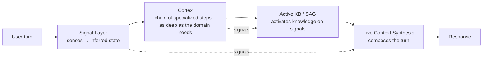

# Adaptive Reasoning Runtime (ARR) — Technology & Innovation

> **Internal draft — for discussion before it goes out.** Positioning for investors and customers.
> Everything here maps to a real mechanism in the codebase; code pointers are included so the
> claims survive a technical read. Narrative/metaphor lines are marked as such.

---

## The one line

**Adaptive Reasoning Runtime (ARR) — powered by Signal.**

Every agent builder on the market wraps an LLM in a **static workflow** — a graph / state machine
where each node handles one small step. ARR does the opposite: it composes the agent's *entire
reasoning context* — instructions, knowledge, and control flow — **live, every turn, from real-time
signals**. The agent isn't walking a script. It's re-assembling itself around the person in front of it.

---

## The category shift

| Everyone else (n8n, Voiceflow, Botpress, "flow" builders) | **ARR** |
|---|---|
| LLM wrapped in a **static graph / state machine** | LLM inside a **context-composition runtime** |
| Each node = a small step; the agent never sees the whole picture | Full context assembled per turn |
| Conversation path is **authored and finite** | Path is **emergent, per customer** |
| Knowledge is **retrieved when asked** (RAG) | Knowledge is **activated from signals** (SAG) |
| New technology used to rebuild **old menu / state chatbots** | New technology used the way it was meant to be |

The industry took a genuinely new technology (the LLM) and used it to rebuild the *old* thing — a
scripted, stateful chatbot with no room to think. ARR is the runtime that lets the model actually
reason with depth, because it's fed the right context, knowledge, and framing at the right moment.

---

## The thesis *(narrative layer — this is the story, the mechanism is below)*

> An LLM on its own is autocomplete. We didn't change the model — we built the **nervous system
> around it**: a layer that *senses*, a core that *reasons*, a knowledge fabric that already *knows
> what you need*, and a composer that *rebuilds the agent's mind every turn*. The result behaves as
> if it genuinely understands and adapts — because, in context, it does.

---

## The architecture: four subsystems on one spine (**Signal**)

Everything in ARR runs on **signals** — structured, inferred state drawn live from the conversation.
The sensors emit signals; the reasoning core operates on signals; the knowledge fabric activates on
signals; the prompt is composed from signals. One spine, four named subsystems.

### 1. Signal Layer — *the sensors*
**What it is:** a perception layer that continuously reads the conversation and emits **structured
inferred state** — not keywords, meaning.
**How it works (grounded):** specialized extractor **steps (addons)** run **in parallel** with the
main response, on a buffered stream, and write structured state (fields, grouped by domain) into
conversation memory. Nothing is hardcoded — each step is an addon with its own model and behavior.
See `crew/services/dispatcher.service.js` (`_runExtractor`, the buffered parallel-execution block)
and the addon runtime under `builder/runtime/`.
**Why it's different:** most builders act only on what the user literally typed. ARR is always
listening on many channels at once and turning talk into *state*.
**The line:** *"The agent is always listening — for meaning, not keywords."*

### 2. Cortex — *the reasoning chain (the "chain reaction")*
**What it is:** each turn runs a **chain of specialized steps (addons)** — a step can infer a signal,
pull knowledge, reason, plan, or speak — composed into one behavior. A domain uses **as many steps as
it needs**, not a fixed shape; a "thinker" and a "talker" are two *possible* steps, not the whole
structure. Steps run across lanes (blocking / background / offline), and each addon has its own model
and configuration — nothing is generic or set in advance.
**How it works (grounded):** the dispatcher runs the crew's Cortex — an authorable chain of addons —
with parallel extraction and signal-driven crew transitions; models are provider-agnostic with
automatic fallback. See `crew/services/dispatcher.service.js` (`_streamCrew`,
`preMessageTransfer` / `postMessageTransfer` / `postThinkingTransfer`), `crew/base/CrewMember.js`,
`builder/runtime/`, and `docs/guides/CREW_CHAIN_ARCHITECTURE.md`.
**Why it's different:** it isn't one clever prompt pretending to be smart — it's a **compound system**
(a domain-deep chain of specialized steps composed into behavior). Stacking as many narrow steps as
the domain needs is what turns autocomplete into something that reasons deeply and adapts.
**The line:** *"Not a prompt — a reasoning chain, as deep as the domain needs."*

### 3. Active KB — *powered by Signal-Augmented Generation (SAG)*
**What it is:** a knowledge base that **activates on inferred signals, not on the user's words** — so
the right knowledge surfaces *before* the user asks, even when they never mentioned the topic.
**How it works (grounded):** the crew selects knowledge sources **dynamically from live context**
(`context.knowledgeBaseSources` in `dispatcher.service.js`), and value-gated knowledge sections
switch in and out by field state (Dynamic Context / value-gated knowledge modules — see
`docs/guides/BUILDER_V2_DYNAMIC_CONTEXT.md` and the token resolution in
`builder/runtime/promptAssembler.js`).
**Why it's different — SAG vs. RAG:**

| | **RAG** (everyone) | **SAG** (ARR) |
|---|---|---|
| Trigger | The user's words (semantic match) | The system's **inferred state** |
| Behavior | **Reactive** — answers what's asked | **Anticipatory** — brings what's needed |
| If the user never mentions it | Nothing surfaces | The right knowledge still activates |
| Good for | Q&A | Leading a real, deep flow |

**The defensible answer to "triggered by what, then?":** by the Signal Layer's inferred state — the
structured conclusions the Cortex draws from the conversation. Activation is on *inferred state*, not
on lexical match.
**The line:** *"A knowledge base that doesn't wait to be asked."*

### 4. Live Context Synthesis (LCS) — *per-turn composition*
**What it is:** the agent's whole operating context — instructions, persona, active knowledge, prior
reasoning — is **recomposed every single turn** from the current signals. No fixed prompt, no fixed
states.
**How it works (grounded):** the final instruction set is assembled per turn from guidance + persona
+ live context + the thinker's advice + dynamically-substituted tokens (fields, personas, parameters,
knowledge, dynamic-context sections). See the prompt-assembly block in
`dispatcher.service.js` (`assembledPrompt`) and the token engine in `builder/runtime/promptAssembler.js`.
**Why it's different:** competitors *select* a context (RAG) or *branch* to an authored state (graph).
ARR **synthesizes** the context — from independent signal dimensions, the space is combinatorial, not
an enumerable set of nodes.
**The line:** *"It never runs the same agent twice."*

---

## How they connect (why it's a platform, not features)

**Signal Layer** senses → **Cortex** reasons over the signals → **SAG** activates the right knowledge
on those signals → **Live Context Synthesis** composes it all into the turn. Four named subsystems
that *feed each other*, on one spine. That's a real system, not three prompts in a trench coat.

---

## What this unlocks *(the customer-facing outcomes)*

- **Depth other builders can't reach** — the agent holds the whole picture and can run genuinely deep
  processes, not a menu of nodes.
- **Adapts per customer** — two conversations never share the same path, prompt, or reaction.
- **Proactive, not reactive** — it surfaces the right knowledge and next step before being asked.
- **Feels like talking to an expert who's actually listening** — because the context is rebuilt around
  each person, each turn.

---

## The business shape *(brief — for the room)*

Every other builder sells a **toolbox**: the customer (or an army of "builders") has to assemble the
agent. **We sell the finished expert.** ARR is vertically integrated — we own the runtime **and** the
domain knowledge **and** the delivered solution, currently in **menopause** and **banking**. The
domain "bibles" (expertise encoded as executable, signal-activated knowledge) are a compounding asset
a horizontal builder can't cheaply cross. *(Domain expertise sells hardest to customers; lead
investors with the architecture above.)*

---

## Tech stack

- **Runtime / server:** Node 22, Express 5, streaming over Server-Sent Events (SSE).
- **Models (provider-agnostic router):** OpenAI (GPT-4o / GPT-5 family), Anthropic (Claude), Google
  (Gemini) — resolved per crew, with automatic fallback. Central registry in `services/models.service.js`;
  all calls go through `services/llm.js`.
- **State & memory:** PostgreSQL + Drizzle ORM (conversation state, collected fields, context, versions).
- **Knowledge:** **Pinecone** vector index; knowledge modules are **signal-gated** — they activate on inferred state (SAG), resolved per turn (`services/kb.resolver.js`).
- **Authoring:** Builder V2 — React 19 + TypeScript + Vite, CSS Modules.
- **Delivery:** Firebase Hosting (client), Google Cloud Run (server).

---

## Grounding & further reading

- `docs/product/ASPECT_OVERVIEW.md` — what Aspect is, building blocks, code-verified strengths.
- `docs/guides/CREW_CHAIN_ARCHITECTURE.md` — the runtime: dispatcher, CrewMember, thinker/talker, transitions (the **Cortex**).
- `docs/guides/BUILDER_V2_DYNAMIC_CONTEXT.md` — value-gated knowledge modules (part of **Active KB / SAG**).
- `docs/guides/BUILDER_V2.md` — the authoring tool that configures all of the above.
- Code: `crew/services/dispatcher.service.js`, `crew/base/CrewMember.js`, `builder/runtime/promptAssembler.js`, `services/kb.resolver.js`, `services/llm.js`.

---

## Appendix — talk track (internal): how to answer "okay, but how?"

Keep every claim to what's true; the true version is the strong version.

- **"You made the LLM think?"** → *"We didn't change the model. We built the runtime around it — a
  Signal Layer that perceives, a Cortex that reasons in specialized passes, an Active KB that activates
  on inferred state, and Live Context Synthesis that recomposes the agent every turn. The model reasons
  with depth because we feed it the right context at the right moment."*
- **"Isn't every builder dynamic context?"** → *"They select a context (RAG) or branch to an authored
  state (graph). We synthesize the context from independent live signals — the space is combinatorial,
  not a finite set of nodes. It never runs the same agent twice."*
- **"How does SAG surface knowledge without the user asking?"** → *"Our sensors extract structured
  inferred state; knowledge activates on that state, not on lexical match to the user's words."*
- **What NOT to say** (fails technical due diligence): "we gave the model emotions/soul," "we made
  autocomplete literally think," "we reverse-engineered the brain," or any claimed IP not actually
  filed. The soul/nervous-system language stays as *explicitly-flagged narrative*, next to the
  mechanism — never as a spec claim.
